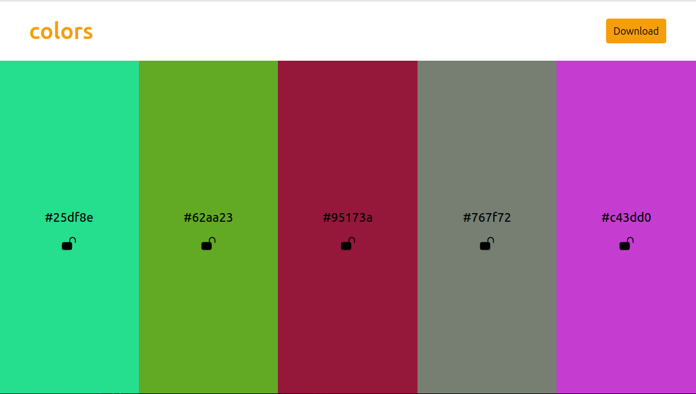

# Color Palette Generator

A color palette generator application built using React, HTML, and Tailwind CSS. It allows you to randomly generate color palettes, lock colors you want to keep, copy them to the clipboard, and download the entire palette as an image.

> _Replace the above placeholder with a path to your screenshot._

## Features

- **Random Color Generation**: Press the **Space** key to randomly generate a new color palette.
- **Lock Colors**: Click the lock icon to lock a color, preventing it from changing during the next palette generation.
- **Copy Colors**: Click the color code to copy it to your clipboard.
- **Download Palette**: Download the entire palette as a PNG image.
